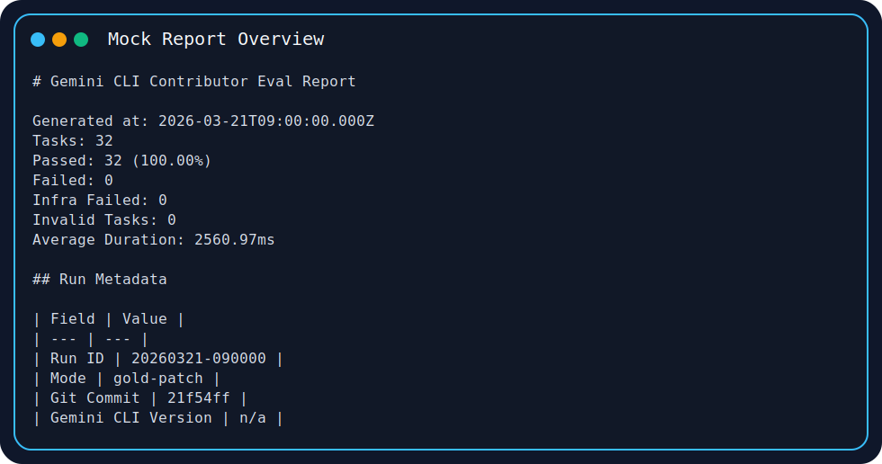
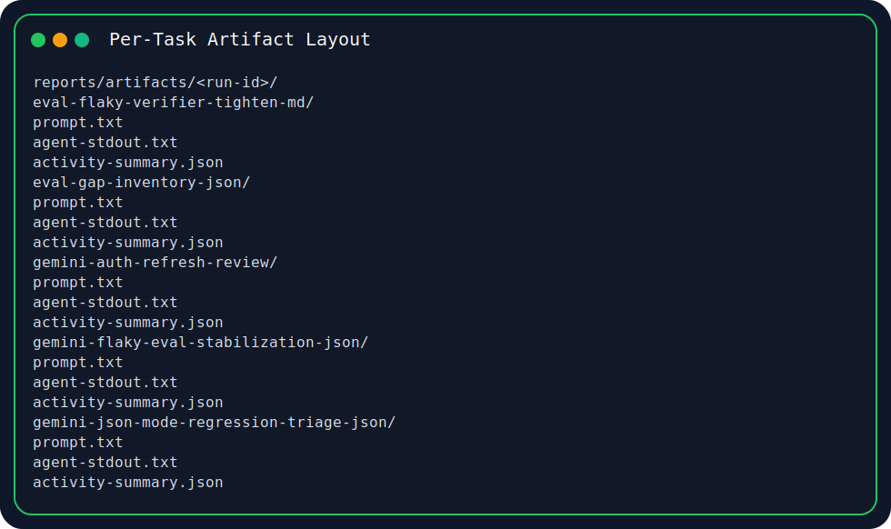
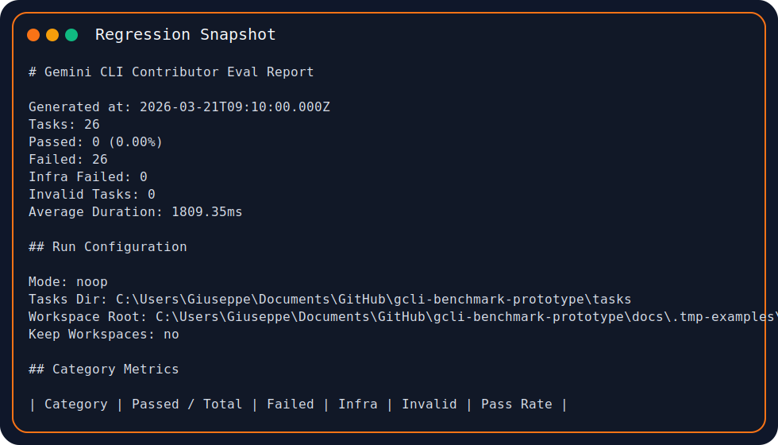

# gcli-benchmark-prototype

Contributor eval harness for Gemini CLI quality work, built around deterministic tasks, objective verification, and inspectable regression artifacts.

## Current Snapshot

As of March 21, 2026, the checked-in benchmark baseline covers 26 tasks and passes at 100%.

- 26 total tasks across `workspace-edit`, `prompt-output`, and `tool-use`
- 26/26 passing in the checked-in gold baseline
- full report and JSON artifacts committed in-repo for inspection

Primary references:

- [`baseline/baseline.json`](./baseline/baseline.json)
- [`reports/latest-report.md`](./reports/latest-report.md)
- [`reports/latest-results.json`](./reports/latest-results.json)

## Why Contributors Use This

- validate changes locally before opening a PR
- compare current behavior against a saved baseline
- inspect per-task prompts, diffs, stdout, stderr, and tool-usage summaries
- extend coverage with small, reviewable task fixtures instead of ad hoc one-off scripts

## What The Harness Evaluates

The suite currently includes 26 deterministic tasks across three task kinds:

- `workspace-edit`: repo-backed fixes verified by fail-to-pass and pass-to-pass commands
- `prompt-output`: strict response-shape tasks scored from agent stdout
- `tool-use`: investigation tasks scored from both the final answer and normalized tool-usage activity

Gemini-CLI-specific contributor coverage now includes:

- tool-use inspection for CLI JSON-mode regressions
- strict repo triage for Gemini CLI ownership and first-file selection
- output-format regression summaries for script-facing compatibility breaks
- maintainer handoff prompts with exact Markdown structure
- eval gap inventory and flaky-verifier maintenance prompts
- contributor-tooling commands for coverage gaps, run comparison, and chat-log task drafts

Current suite shape:

- 26 total tasks
- 12 `workspace-edit` tasks
- 7 `prompt-output` tasks
- 7 `tool-use` tasks
- 17 `multi-file` tasks
- 9 `single-file` tasks

## Example Artifacts

Deterministic mock examples live under [`docs/examples`](./docs/examples) and can be refreshed with `npm run docs:examples`.







See the checked-in examples directly:

- [`docs/examples/mock-report.md`](./docs/examples/mock-report.md)
- [`docs/examples/mock-results.json`](./docs/examples/mock-results.json)
- [`docs/examples/mock-regression.md`](./docs/examples/mock-regression.md)

## Installation

Prerequisites:

- Node.js 20+
- Gemini CLI installed and authenticated as `gemini` for real-agent runs

Install dependencies:

```bash
npm install
```

## Quick Start

List the available tasks and coverage slices:

```bash
npm run dev:list
```

Run the full suite with Gemini CLI:

```bash
npm run dev:run
```

Run a focused subset:

```bash
npm run dev:run -- --task=node-config-precedence --task=tool-router-root-cause
```

Run a Gemini-quality subset:

```bash
npm run dev:run -- --task=gemini-tool-json-mode-root-cause --task=gemini-repo-triage-json --task=gemini-output-regression-summary
```

Find under-covered slices and a recommended starting template:

```bash
npm run dev:gaps
```

Compare a run against its baseline with contributor-facing summaries:

```bash
npm run dev:compare -- --results reports/latest-results.json --baseline baseline/baseline.json
```

Draft a new task from a structured chat log:

```bash
npm run dev:draft-task -- --chat-log examples/chat-log.json --task-id draft-task --task-kind tool-use --category debugging --language text --out drafts/draft-task
```

Run the deterministic mock path used in CI:

```bash
npm run dev:run -- --agent-mode=gold-patch
```

## How A Contributor Would Catch A Regression

1. Run the tasks that cover the area you changed.

```bash
npm run dev:run -- --task=node-config-precedence --task=prompt-regression-triage-json
```

2. Compare the run against the baseline.

The harness exits with `2` when regressions are detected against the current baseline.

3. Inspect the generated artifacts.

- `reports/latest-report.md`
- `reports/latest-results.json`
- `reports/artifacts/<run-id>/<task-id>/prompt.txt`
- `reports/artifacts/<run-id>/<task-id>/activity-summary.json`
- `reports/artifacts/<run-id>/<task-id>/git-diff.patch`

4. Refresh the baseline only when the expected benchmark behavior intentionally changed.

```bash
npm run baseline:update
```

## Task Authoring Model

Every task lives under `tasks/<task-id>/` and declares a `taskKind` in `task.json`.

- `workspace-edit` requires `repo/` and `gold.patch`
- `prompt-output` requires `gold.stdout.txt`
- `tool-use` requires `gold.activity.jsonl`
- `gold.stderr.txt` is optional for non-workspace tasks

Verification and setup commands support:

- `${taskDir}`
- `${workspaceDir}`
- `${artifactDir}`

Tool-use tasks also get a normalized `activity-summary.json` artifact so they can assert on ordered tool calls and inspected targets without depending on provider-specific raw logs.

Tool-use tasks can also declare `toolExpectations` so the harness can surface missing required inspections, wrong first inspections, and ordered-path violations directly in reports and JSON results.

More detail:

- [`docs/ADDING_TASKS.md`](./docs/ADDING_TASKS.md)
- [`docs/ROADMAP.md`](./docs/ROADMAP.md)

## Checked-In Benchmark Proof

The strongest front-page proof point is the current checked-in benchmark snapshot from March 21, 2026:

```text
Generated at: 2026-03-21T08:45:00.000Z
Tasks: 26
Passed: 26 (100.00%)
Failed: 0
Infra Failed: 0
Invalid Tasks: 0
Mode: gold-patch
```

That snapshot is deterministic and inspectable in-repo, which makes it a better statement of harness maturity than the older subset example below. It shows the harness already supports the core contributor loop end to end: curated task loading, objective scoring, baseline comparison, and per-task artifact inspection across all three task kinds.

## Archived Real Gemini CLI Subset Run

The repo also includes one archived real Gemini CLI subset run from March 15, 2026:

```bash
npm run dev:run -- --agent-mode=gemini-cli --task=node-cache-key-review --task=node-cli-json-output --task=node-config-precedence --task=node-header-merge-review --task=node-keyword-normalizer-refactor --task=node-router-path-normalization --task=node-slug-shared-normalizer
```

Artifacts:

- [`reports/report-20260315-181002.md`](./reports/report-20260315-181002.md)
- [`reports/results-20260315-181002.json`](./reports/results-20260315-181002.json)

Report excerpt:

```text
Generated at: 2026-03-15T18:10:02.028Z
Tasks: 7
Passed: 5 (71.43%)
Infra Failed: 2
Mode: gemini-cli
Model: Gemini CLI default
```

This is still useful as a real-agent reference point, but it should be read as a narrower historical subset run, not as the current size or capability of the harness.

One failure analysis from that run:

- `node-cache-key-review` timed out after 120000ms while another code-review task in the same subset passed, which makes the harness useful for contributor quality work beyond simple correctness. It surfaces when Gemini CLI can solve the patch but struggles to finish a review-style task inside the evaluation budget.

## Reports

Each run writes:

- `reports/latest-results.json`
- `reports/latest-report.md`
- archived timestamped copies in `reports/`
- per-task artifacts in `reports/artifacts/<run-id>/`

The Markdown and JSON reports now surface:

- category coverage
- task-kind coverage
- taxonomy coverage
- efficiency metrics
- failure breakdowns by reason, category, and task kind
- regression findings
- per-task failure analysis, including first failing verifier and first observed tool call
- per-task artifact paths, including `activity-summary.json`

## Commands

```bash
npm run dev:list
npm run dev:gaps
npm run dev:compare
npm run dev:draft-task
npm run dev:run
npm run dev:run -- --agent-mode=gold-patch
npm run dev:run -- --agent-mode=noop
npm run baseline:update
npm run docs:examples
npm test
```

## Approval Policy

The Gemini adapter now exposes approval mode as harness policy:

- `--approval-mode <value>`
- `GCLI_BENCHMARK_APPROVAL_MODE=<value>`

Precedence is explicit CLI flag, then environment variable, then the compatibility default of `yolo`.

## Roadmap

The harness is already past the initial bootstrap stage. It covers repo edits, prompt-output behavior, tool-use behavior, contributor authoring support, and Gemini-CLI-specific debugging workflows today. From here, the roadmap is about expanding coverage beyond the current 26-task suite, tightening regression policy, improving contributor templates, and keeping the deterministic mock examples fresh rather than changing the core harness model.
