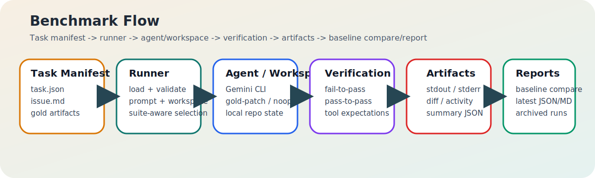

# gcli-benchmark-prototype

Deterministic contributor eval harness for Gemini CLI quality work. The main claim of this prototype is that contributor-facing failures can be measured, classified, and inspected with stable artifacts; the live Gemini CLI runs below are benchmark evidence, not a claim that Gemini CLI already scores well on the suite.

## Live Gemini CLI Evidence

These March 24, 2026 runs are the front-page signal for the project. They are not flattering yet, and that is useful: a good contributor eval harness should show strict-output misses, missing inspections, and time-budget infra failures clearly instead of hiding them behind a mocked success path.

| Live run | Date (UTC) | Tasks | Passed | Failed | Infra failed | What the harness surfaced | Exact artifacts |
| --- | --- | --- | --- | --- | --- | --- | --- |
| `gemini-core` | 2026-03-24 12:50 | 11 | 0 | 7 | 4 | strict JSON/output mismatches, wrong first inspections, missing required inspections, 120000ms timeouts | [`report-20260324-125017.md`](./reports/live-gemini-core/report-20260324-125017.md), [`results-20260324-125017.json`](./reports/live-gemini-core/results-20260324-125017.json) |
| `contributor-workflows` | 2026-03-24 13:18 | 10 | 0 | 6 | 4 | maintainer-output mismatches, missing inspection evidence, 120000ms timeouts on review-style prompts | [`report-20260324-131841.md`](./reports/live-contributor-workflows/report-20260324-131841.md), [`results-20260324-131841.json`](./reports/live-contributor-workflows/results-20260324-131841.json) |

If a live task fails because of a Gemini CLI limitation, that is still a useful benchmark outcome. The point is that the harness can classify the failure and preserve the artifacts needed to inspect it.

### What The Current Live Failures Prove

- The harness separates strict-output failures, wrong investigation paths, and infra timeouts instead of collapsing them into one generic miss.
- Each failed task keeps enough local evidence for a contributor or maintainer to inspect what the agent answered, what it read first, and where verification broke.
- The zero-pass snapshots are intentionally checked in because a quality harness should make weak behavior obvious before it makes it pretty.

### `gemini-core` Per-Task Outcomes

| Task | Status | Why the harness marked it that way |
| --- | --- | --- |
| [`gemini-auth-refresh-review`](./tasks/gemini-auth-refresh-review/) | `infra_failed` | Gemini CLI timed out after 120000ms on the workspace-edit auth task. |
| [`gemini-json-mode-regression-triage-json`](./tasks/gemini-json-mode-regression-triage-json/) | `failed` | Strict JSON output did not match the expected regression-triage payload. |
| [`gemini-models-json-compat`](./tasks/gemini-models-json-compat/) | `infra_failed` | Gemini CLI timed out after 120000ms on the workspace-edit JSON-compat task. |
| [`gemini-output-regression-summary`](./tasks/gemini-output-regression-summary/) | `failed` | Exact summary output did not match the expected compatibility report text. |
| [`gemini-repo-triage-json`](./tasks/gemini-repo-triage-json/) | `failed` | Strict JSON repo-triage answer did not match the expected structure/content. |
| [`gemini-repo-triage-owner-selection-json`](./tasks/gemini-repo-triage-owner-selection-json/) | `failed` | Strict JSON owner-selection answer did not match the expected structure/content. |
| [`gemini-tool-debug-workflow-command-choice`](./tasks/gemini-tool-debug-workflow-command-choice/) | `failed` | Tool path was wrong: the first tool call was expected to inspect `node --test test/repro-json.test.js`. |
| [`gemini-tool-first-inspection-root-cause`](./tasks/gemini-tool-first-inspection-root-cause/) | `infra_failed` | Gemini CLI timed out after 120000ms on the investigation task. |
| [`gemini-tool-json-mode-log-order-root-cause`](./tasks/gemini-tool-json-mode-log-order-root-cause/) | `failed` | Tool path was wrong: the first inspection was expected to hit `fixtures/run-json-output.txt`. |
| [`gemini-tool-json-mode-root-cause`](./tasks/gemini-tool-json-mode-root-cause/) | `infra_failed` | Gemini CLI timed out after 120000ms on the investigation task. |
| [`gemini-tool-output-routing-review`](./tasks/gemini-tool-output-routing-review/) | `failed` | Required inspection was missing: `test/models-json.test.js` was not read before answering. |

### `contributor-workflows` Per-Task Outcomes

| Task | Status | Why the harness marked it that way |
| --- | --- | --- |
| [`eval-flaky-verifier-tighten-md`](./tasks/eval-flaky-verifier-tighten-md/) | `infra_failed` | Gemini CLI timed out after 120000ms on the maintainer-guidance prompt. |
| [`eval-gap-inventory-json`](./tasks/eval-gap-inventory-json/) | `failed` | Strict JSON coverage-gap output did not match the expected payload. |
| [`gemini-flaky-eval-stabilization-json`](./tasks/gemini-flaky-eval-stabilization-json/) | `failed` | Strict JSON stabilization plan did not match the expected payload. |
| [`gemini-maintainer-handoff-md`](./tasks/gemini-maintainer-handoff-md/) | `infra_failed` | Gemini CLI timed out after 120000ms on the maintainer-handoff prompt. |
| [`gemini-maintainer-repro-reply-md`](./tasks/gemini-maintainer-repro-reply-md/) | `failed` | Exact Markdown maintainer reply did not match the expected structure/content. |
| [`gemini-tool-debug-trace-repro-workflow`](./tasks/gemini-tool-debug-trace-repro-workflow/) | `infra_failed` | Gemini CLI timed out after 120000ms on the debug-workflow tool task. |
| [`gemini-tool-maintainer-regression-handoff`](./tasks/gemini-tool-maintainer-regression-handoff/) | `failed` | Required inspection was missing: `fixtures/run-report.md` was not read before the handoff answer. |
| [`prompt-regression-triage-json`](./tasks/prompt-regression-triage-json/) | `failed` | Strict JSON regression triage output did not match the expected payload. |
| [`prompt-review-findings-markdown`](./tasks/prompt-review-findings-markdown/) | `infra_failed` | Gemini CLI timed out after 120000ms on the review-style prompt. |
| [`tool-regression-review`](./tasks/tool-regression-review/) | `failed` | The final answer and investigation path did not satisfy the review verification checks. |

## How This Maps To The GSoC Project

This repo is meant to be read against the official "Behavioral Evaluation Test Framework" bullets, not as a generic benchmark experiment.

| GSoC project outcome | Repo evidence today |
| --- | --- |
| Evaluation framework with standardized test harness | Deterministic runner, shared task contract, objective verification commands, artifact capture, and suite-aware CLI in [`src/`](./src/). |
| Benchmark suite covering 50+ coding scenarios across categories | Current corpus is 32 deterministic tasks across 3 suites and 4 categories, with the roadmap explicitly aimed at pushing this past 50 before the project is "done". |
| Automated scoring and success rate metrics | Markdown/JSON reports compute pass rate, failure breakdowns, suite coverage, task-kind coverage, taxonomy coverage, and per-task failure analysis. |
| Regression detection system integrated with CI/CD | Baseline comparison is built in, regressions surface in reports, and CI runs both mock calibration and Node test matrix workflows. |
| Dashboard or report generation for evaluation results | Every run emits inspectable Markdown, JSON, and per-task artifacts under [`reports/`](./reports/). |
| Documentation for adding new evaluation scenarios | [`docs/ADDING_TASKS.md`](./docs/ADDING_TASKS.md), [`docs/task.schema.json`](./docs/task.schema.json), and [`docs/minimal-task-examples/README.md`](./docs/minimal-task-examples/README.md) document the authoring contract. |
| Baseline metrics for current Gemini CLI version | Archived March 24, 2026 live runs are checked in for Gemini CLI `0.32.1`, alongside a 32/32 deterministic gold-patch harness calibration baseline. |

## Suite Taxonomy

The benchmark is split into reviewer-facing suites instead of one undifferentiated pile of tasks.

| Suite | Tasks | What it covers | Why it matters |
| --- | --- | --- | --- |
| `gemini-core` | 11 | direct Gemini CLI quality evidence: JSON mode, repo triage, output routing, debugging, and tool-use sequencing | this is the most direct evidence for the GSoC proposal |
| `contributor-workflows` | 10 | maintainer replies, review findings, eval triage, flaky-eval investigation, and contributor-facing reporting | this shows whether the harness helps real OSS contribution workflows |
| `harness-calibration` | 11 | generic deterministic fixtures for benchmark integrity and regression detection | this proves the harness is working even when live-agent quality is weak |

Current corpus shape:

- 32 total tasks
- 12 `workspace-edit` tasks
- 11 `prompt-output` tasks
- 9 `tool-use` tasks
- 23 `multi-file` tasks
- 9 `single-file` tasks

## Architecture

Simple system view:



Editable source: [`docs/assets/architecture-flow.mmd`](./docs/assets/architecture-flow.mmd)

## Reproducible Run Metadata

Reviewers should not have to guess what changed between runs.

| Run | Run ID | Date (UTC) | Mode | Suite(s) | Tasks | Gemini CLI | Model | Approval | Git SHA | Node / platform | Exact artifacts |
| --- | --- | --- | --- | --- | --- | --- | --- | --- | --- | --- | --- |
| Gold-patch harness calibration | `20260324-123859` | 2026-03-24 12:38 | `gold-patch` | all 3 suites | 32 | n/a | n/a | n/a | `21f54ff` | `v20.19.0` on `win32/x64` | [`report-20260324-123859.md`](./reports/report-20260324-123859.md), [`results-20260324-123859.json`](./reports/results-20260324-123859.json), [`baseline.json`](./baseline/baseline.json) |
| Live Gemini run | `20260324-125017` | 2026-03-24 12:50 | `gemini-cli` | `gemini-core` | 11 | `0.32.1` | Gemini CLI default | `yolo` | `21f54ff` | `v20.19.0` on `win32/x64` | [`report-20260324-125017.md`](./reports/live-gemini-core/report-20260324-125017.md), [`results-20260324-125017.json`](./reports/live-gemini-core/results-20260324-125017.json) |
| Live Gemini run | `20260324-131841` | 2026-03-24 13:18 | `gemini-cli` | `contributor-workflows` | 10 | `0.32.1` | Gemini CLI default | `yolo` | `21f54ff` | `v20.19.0` on `win32/x64` | [`report-20260324-131841.md`](./reports/live-contributor-workflows/report-20260324-131841.md), [`results-20260324-131841.json`](./reports/live-contributor-workflows/results-20260324-131841.json) |

## Gold-Patch Harness Calibration

The deterministic harness-calibration path is still important, but it is a harness-integrity signal, not a live Gemini quality claim.

- 32/32 passing on March 24, 2026
- exact baseline committed in [`baseline/baseline.json`](./baseline/baseline.json)
- latest full-suite calibration report in [`reports/latest-report.md`](./reports/latest-report.md)
- latest full-suite calibration JSON in [`reports/latest-results.json`](./reports/latest-results.json)

The gold-patch path is what validates task loading, verification, artifact generation, suite accounting, and regression comparison end to end. It should not be read as "Gemini CLI scored 32/32."

## Mock Examples

Deterministic example artifacts for docs and screenshots live under [`docs/examples`](./docs/examples) and are refreshed with `npm run docs:examples`.


Direct references:

- [`docs/examples/mock-report.md`](./docs/examples/mock-report.md)
- [`docs/examples/mock-results.json`](./docs/examples/mock-results.json)
- [`docs/examples/mock-regression.md`](./docs/examples/mock-regression.md)

## Installation

Prerequisites:

- Node.js 20+
- Gemini CLI installed and authenticated as `gemini` for live runs

Install dependencies:

```bash
npm install
```

## Quick Start

List the current corpus with suite counts:

```bash
npm run dev:list -- --json
```

List only the direct Gemini suite:

```bash
npm run dev:list -- --suite=gemini-core --json
```

Run deterministic harness calibration:

```bash
npm run dev:run -- --agent-mode=gold-patch
```

Run the live Gemini CLI `gemini-core` suite:

```bash
npm run dev:run -- --agent-mode=gemini-cli --suite=gemini-core --reports reports/live-gemini-core
```

Run the live Gemini CLI `contributor-workflows` suite:

```bash
npm run dev:run -- --agent-mode=gemini-cli --suite=contributor-workflows --reports reports/live-contributor-workflows
```

Compare a run against the deterministic baseline:

```bash
npm run dev:compare -- --results reports/live-gemini-core/latest-results.json --baseline baseline/baseline.json
```

Validate one task directory before loading the whole corpus:

```bash
npm run dev:validate-task -- --task-dir ./tasks/gemini-tool-output-routing-review
```

Scaffold a new task from a structured chat log:

```bash
npm run dev:draft-task -- --chat-log docs/examples/chat-log.json --task-id draft-task --task-kind tool-use --category debugging --language text --out drafts/draft-task
```

The draft command is intentionally a scaffold generator: it creates a starting task skeleton and placeholder gold artifacts, not a finished eval.

## Task Authoring

Task authoring is schema-backed and suite-aware.

- Authoring guide: [`docs/ADDING_TASKS.md`](./docs/ADDING_TASKS.md)
- Manifest schema: [`docs/task.schema.json`](./docs/task.schema.json)
- Minimal examples: [`docs/minimal-task-examples/README.md`](./docs/minimal-task-examples/README.md)
- Single-task validation: `npm run dev:validate-task -- --task-dir ./tasks/<task-id>`
- Draft-task scaffold command: `npm run dev:draft-task`

Every task now declares one primary `suite`:

- `gemini-core`
- `contributor-workflows`
- `harness-calibration`

Cross-cutting behavior belongs in taxonomy tags, not in multi-suite membership.

`draft-task` is positioned as an authoring accelerator, not as automatic eval generation. Contributors should still tighten fixtures, verification, and suite placement before promoting a draft into `tasks/`.

## Testing, Packaging, And OSS Basics

The repo is shaped to look like outside contributors can actually use it.

- Unit, integration, and e2e benchmark tests are split across `npm run test:unit`, `npm run test:integration`, and `npm run test:e2e`.
- CI now has a Node 20/22 matrix plus a separate mock calibration workflow.
- `package.json` is no longer private; it has `bin`, `files`, `engines`, repository metadata, and an `npm pack --dry-run` guardrail in CI.
- The package is in a publishable shape, but it is not published to npm yet.
- OSS basics are checked in: [`LICENSE`](./LICENSE), [`CONTRIBUTING.md`](./CONTRIBUTING.md), and [`CODE_OF_CONDUCT.md`](./CODE_OF_CONDUCT.md).

## Roadmap And Tracking

- Canonical public backlog: [GitHub issues](https://github.com/GiuseppeFrigeni/gcli-benchmark-prototype/issues)
- Mirrored roadmap summary: [`docs/ROADMAP.md`](./docs/ROADMAP.md)
- Mirrored issue index: [`docs/ROADMAP_ISSUES.md`](./docs/ROADMAP_ISSUES.md)
- This implementation pass log: [`docs/IMPLEMENTATION_LOG.md`](./docs/IMPLEMENTATION_LOG.md)
